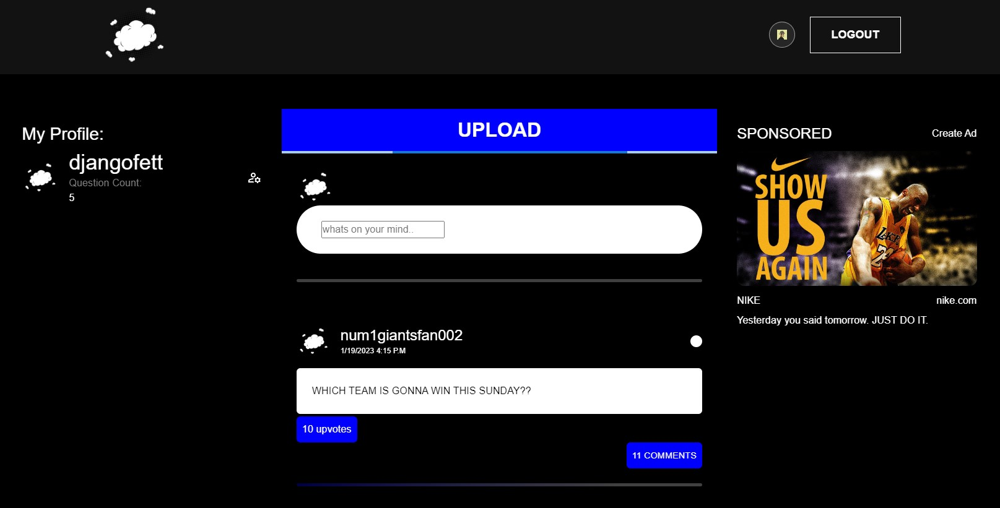

# 🙋‍♀️ Let Me Ask You 🙋‍♂️

## Description

Let Me Ask You is a Q&A app designed to foster interesting conversation among users based on user-voted questions and compelling answers. Users are greeted on the site with questions that are user-submitted and user-selected that are  thought-provoking. Logged In Users are able to answer questions, ask their own questions and vote on what other user-submitted questions are deserving of front-page discourse. The application utilizes a MERN stack structure to create a dynamic and responsive site.

- [Installation](#installation)
- [Usage](#usage)
- [Features](#future-development)
- [Technologies User](#technologies-used)
- [Credits](#credits)
- [License](#license)
- [Links](#links)

## Installation

To run the application on a local machine, clone the git repo via your preferred method and run `npm install` from the root directory to install all necessary packages. Upon installation run `npm run develop` to run from the root folder and test app locally. Additionally the site can be reached at the live site link.

[Deployed Application](https://polar-sierra-99541.herokuapp.com/)

## Usage

Upon login, Users are met with the homepage which presents a leaderboard carousel of the questions with the most votes. 

Below that, we see all questions displayed. If a question is of interest to a user they can upvote it to move it up in the leaderboard. Users can also view comments and add comments anonymously by clicking the comments button below the question. 

\

On the left side of the home page the user can find their profile which includes their username and a count of the questions they have submitted.

# Future Development
* Expanded tagging to allow for multiple categories per question
* Nested answers to allow further discussion
* Allowing for anonymous posting
* Expanded browsing UI for questions
* Question search

## Technologies Used
* [React](https://reactjs.org/)
* [Node.js](https://nodejs.org/en/)
* [Express.js](https://expressjs.com/)
* [Mongoose](https://mongoosejs.com/)
* [MongoDB](https://www.mongodb.com/)
* [GraphQL](https://graphql.org/)
* [Styled Components](https://www.npmjs.com/package/styled-components)
* [JWT](https://jwt.io/)

## Credits
* [James Patmore](https://github.com/jamestpatmore) - React, React MUI, Auth, Styled Components, Backend Models, TypeDefs/Resolvers
* [Jedediah Schuyler](https://github.com/jschuyl) - Backend Models, TypeDefs/Resolvers, Testing, Database Seeing, Login and Signup, Auth
* [Autumn Legere](https://github.com/autumnlegere) - Backend Models, TypeDefs/Resolvers, Client Queries/Mutations, GraphQl
* [Harrison Burnton](https://github.com/HBurnton) - Backend Models, TypeDefs/Resolvers, Github and Heroku management, ReadMe, Presentation Slidedeck

# Links

* [Deployed Application On Heroku](https://polar-sierra-99541.herokuapp.com/)
* [Project Page On Github](https://github.com/HBurnton/let-me-ask-you-p3)
* [Presentation Slidedeck](https://docs.google.com/presentation/d/1wgxFXTv_Lnm4xS2XxyMJ6vbQxWtMBtfOVxNdIGNlgRM/edit?usp=sharing)